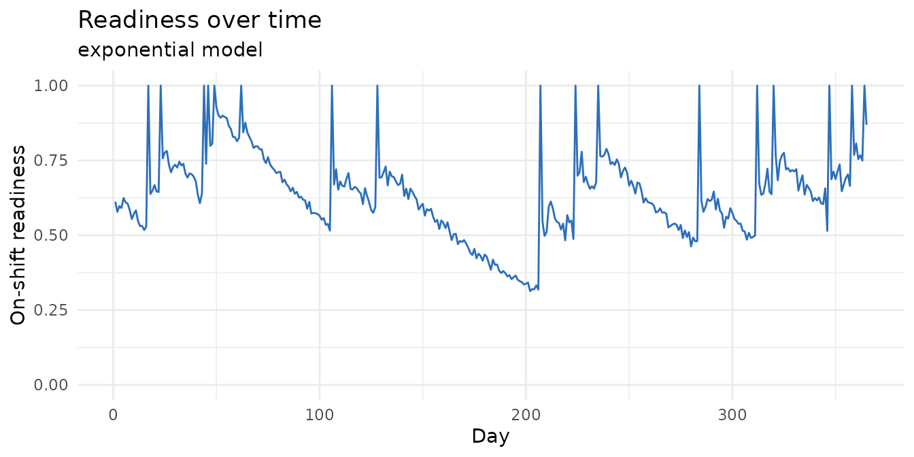
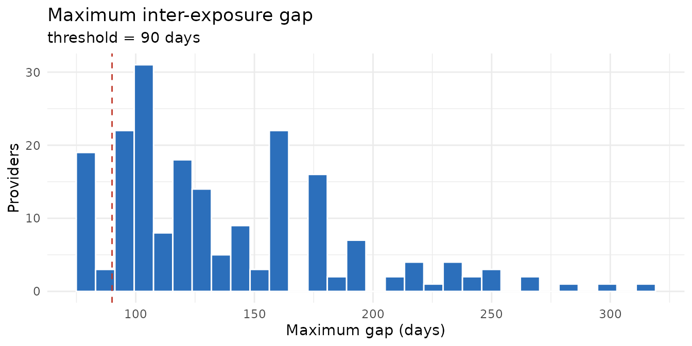
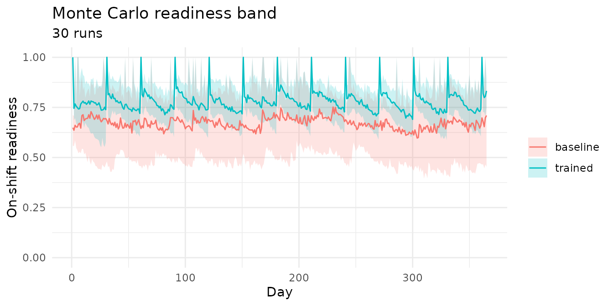

# Getting started with halosimr

`halosimr` simulates exposure to high-acuity, low-occurrence (HALO)
events across a population of providers, models how readiness decays
between exposures, and estimates how training programs change it. It
extends the methodology of the Code Blue Blindspots paper (PMID
41633464).

## The idea

Some clinical events are rare enough that a given provider may see only
a few in a year, yet critical when they occur, and skill at handling
them fades with time since the last one. `halosimr` asks how a provider
population’s preparedness for these HALO events rises and falls over a
year, and how scheduling and training change it.

The model runs on one chain. Events occur on random days. A provider is
**exposed** when they are on shift the day an event happens. Each
exposure **resets** that provider’s **readiness** (a 0-to-1 proxy for
skill, 1 right after an exposure) to full; between exposures readiness
**decays**. The run of days between a provider’s consecutive exposures
is a **gap**, and a long gap means low readiness when the next event
arrives. A **training** session acts as a scheduled reset, topping
readiness back up without waiting for a real event.

So a study has three ingredients:

1.  a **schedule** of who works which shifts,
2.  a stream of **HALO events**,
3.  a **readiness model** that sets how fast skill decays between
    resets.

``` r

library(halosimr)
```

## Build the inputs

Generate a schedule and a stream of events. `schedule_type = "3/7 Day"`
gives each provider three day-shifts per seven-day week; `rate = 0.1`
means about 0.1 HALO events per day, roughly 36 across the year.

``` r

sched <- generate_schedule(
  n_providers = 200, n_days = 365,
  schedule_type = "3/7 Day", seed = 42
)
ev <- generate_events(n_days = 365, rate = 0.1, seed = 42)

dim(sched)         # providers x days; cells "d" (Day), "n" (Night), "o" (Off)
#> [1] 200 365
head(ev)           # one row per event
#>   day_idx       date shift_type
#> 1      10 2024-01-11      night
#> 2      16 2024-01-17        day
#> 3      22 2024-01-23        day
#> 4      22 2024-01-23      night
#> 5      31 2024-02-01      night
#> 6      41 2024-02-11      night
```

The `"Random"` schedule type draws each day from the empirical Day,
Night, and Off weights reported in the Code Blue Blindspots paper (Day =
0.246, Night = 0.230, Off = 0.524). Pass `weights` to override, for
example `weights = c(d = 1/3, n = 1/3, o = 1/3)` for an equal split.

## Run one simulation

[`halo_sim()`](https://emergencymind.github.io/halosimr/reference/halo_sim.md)
bundles the inputs and configuration;
[`hsrun()`](https://emergencymind.github.io/halosimr/reference/hsrun.md)
executes the pipeline and attaches the results. Each readiness model
reads its own parameters: `exponential` uses `readiness_half_life_days`
(days for readiness to halve). `readiness_threshold_days` is separate
from the decay curve; it sets the gap length considered too long, used
for the flag below.

``` r

sim <- halo_sim(
  sched, ev,
  readiness_model = "exponential",
  readiness_half_life_days = 60,
  readiness_threshold_days = 90
)
sim <- hsrun(sim)
sim
#> <halo_sim>  200 providers x 365 days
#>   readiness: exponential   training: none
#>   mean on-shift readiness: 0.637
#>   providers exceeding gap threshold: 89.0%
```

The summary gives the average readiness among on-shift providers and the
share of providers who had at least one gap longer than
`readiness_threshold_days`, a flag for who went dangerously long without
an exposure.

`results_df` summarises each provider’s gaps (the day-counts between
their consecutive exposures). Key columns are `n_events` (exposures in
the window), `gap_max` (their longest gap), and
`max_gap_exceeds_threshold` (whether that longest gap ran past the
threshold):

``` r

head(sim$results_df)
#>   provider_id n_events t2first gap_min gap_q25 gap_median gap_mean gap_q75
#> 1       P0001        5      48      18   25.25       41.5 60.66667   54.75
#> 2       P0002        8      16       2   16.00       28.0 40.44444   53.00
#> 3       P0003        8      45      11   22.00       45.0 40.44444   49.00
#> 4       P0004        7      16       6   10.25       30.5 45.50000   78.50
#> 5       P0005        6     105       1   21.00       38.0 52.00000   82.50
#> 6       P0006        8      16       3   18.00       29.0 40.44444   57.00
#>   gap_max max_gap_exceeds_threshold
#> 1     184                      TRUE
#> 2     129                      TRUE
#> 3      79                     FALSE
#> 4     118                      TRUE
#> 5     118                      TRUE
#> 6     107                      TRUE
```

`proportion_ready_on_shift`, the daily mean readiness across providers
working that day, is the primary outcome.

## Single-run figures

`plot_readiness` traces the on-shift readiness curve across the year;
`plot_gap_distribution` shows how provider maximum gaps are distributed,
with the threshold marked.

``` r

plot_readiness(sim)
```



``` r

plot_gap_distribution(sim)
```



## Compare training programs with Monte Carlo

A single run reflects one random draw of events, so its curve is noisy.
[`hsrunmc()`](https://emergencymind.github.io/halosimr/reference/hsrunmc.md)
repeats the run over `n` different random seeds and summarises the
day-by-day spread: the median readiness across runs, plus a shaded band
for the 10th-to-90th-percentile range. Each seed needs its own fresh
schedule and events, so instead of fixed inputs you pass two functions
that take a seed and build the inputs for that run. When a training
program is set,
[`hsrunmc()`](https://emergencymind.github.io/halosimr/reference/hsrunmc.md)
also runs an untrained baseline arm and reports the lift in readiness:
the per-day gain of the trained arm over the baseline.

``` r

mc <- hsrunmc(
  n = 30,
  schedule_fn = function(s) generate_schedule(200, 365, "3/7 Day", seed = s),
  events_fn   = function(s) generate_events(365, rate = 0.1, seed = s),
  readiness_model = "exponential", readiness_half_life_days = 60,
  training_program = "monthly"
)
mc
#> <halo_mc>  30 runs x 365 days
#>   training: monthly
#>   baseline median readiness: 0.671
#>   trained median readiness:  0.779  (mean lift +0.108)
```

``` r

plot_mc_band(mc)
```



The trained band sits above the baseline; `mc$lift` is the per-day
difference in median readiness.

## Readiness models

Four decay kernels are available and can be called directly on a vector
of days since the last reset:

``` r

days <- c(0, 30, 60, 90, 180)
rbind(
  binary      = readiness_binary(days, threshold = 90),
  exponential = readiness_exponential(days, half_life = 60),
  ebbinghaus  = readiness_ebbinghaus(days, b = 0.05),
  step        = readiness_step(days, t1 = 90, t2 = 180, partial = 0.5)
)
#>             [,1]      [,2] [,3]      [,4]  [,5]
#> binary         1 1.0000000 1.00 1.0000000 0.000
#> exponential    1 0.7071068 0.50 0.3535534 0.125
#> ebbinghaus     1 0.4000000 0.25 0.1818182 0.100
#> step           1 1.0000000 1.00 1.0000000 0.500
```

Select one in a simulation with `readiness_model` plus its parameters,
for example
`halo_sim(..., readiness_model = "step", step_t2_days = 180)`.

## Reports

For a shareable document, render the bundled template, which runs a full
single-run plus Monte Carlo analysis from parameters you supply. Pass
`output_file` to control where the HTML lands; without it the output is
written next to the template inside the installed package.

``` r

rmarkdown::render(
  system.file("report_template.Rmd", package = "halosimr"),
  output_file = path.expand("~/Desktop/halo_report.html"),
  params = list(n_providers = 200, n_days = 365, training_program = "monthly")
)
```
